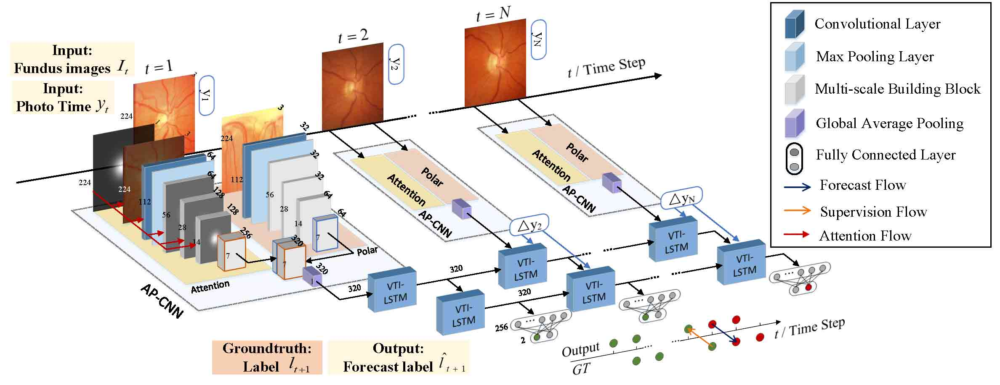
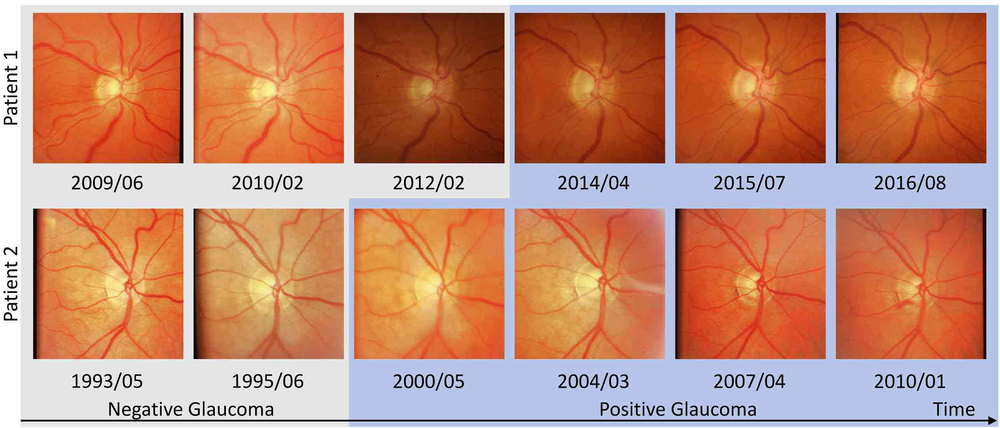
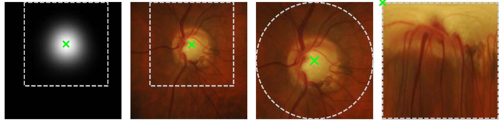

# DeepGF: Glaucoma Forecast Using the Sequential Fundus Images
- This is the official repository of the paper "DeepGF: Glaucoma Forecast Using the Sequential Fundus Images" from **MICCAI 2020**[[Paper Link]](https://link.springer.com/chapter/10.1007/978-3-030-59722-1_60, "Paper Link")[[PDF Link]](https://link.springer.com/content/pdf/10.1007%2F978-3-030-59722-1_60.pdf)



## 1. Environment
- Python >= 3.5
- Tensorflow >= 1.4 is recommended
- opencv-python
- sklearn
- matplotlib


## 2. Dataset
1. The training data and testing data is from the [[SIGF-database]](https://www.dropbox.com/s/a0p05573xx37lfx/SIGF-database.rar?dl=0, "Official SIGF"). Contact [liu.li20@imperial.ac.uk] or [xfwang@buaa.edu.cn] for password of the shared data in dropbox. Below is an example of our SIGF database. 



2. Put the training and test images and the labels in the directory:
```
'./data/train(test)/image(label)/all/'
```

3. Obtain the polar and attention data from the  [[Dropbox]](https://www.dropbox.com/s/q23i1le5vhs9ilv/Polar-Attention.zip?dl=0, "Attention and Polar"). Below is an example of the polar and attention map of a glaucoma fundus image.




4. Put the attention and polar images in the directory:
```
'./data/'
```

## 3. Training

```
    python train.py 
```

## 4. Test

```
    python test.py 
```

## 5. Compared Methods

The network re-implenmentation of [[Chen et al.]](https://ieeexplore.ieee.org/abstract/document/7318462/, "Chen") is in the file of:

```
    chen_net.py
```
and from the directory of 


```
    ./Compared Methods
```

## 6. Ablation Study

If you are interested in our ablation study, please see

```
    ./Ablation study
```

## 7. Network Interpretability

1. If you are interested in the visualization method and results used for showing the interpretability 
of our method, please refer to the directory of

```
    ./saliency
```

2. Or you can just see the images in the directory of 


```
    ./visualization_result
```

for more visualization results.

## 8. Citation
If you find our work useful in your research or publication, please cite our work:
```
@article{Li2020deep,
  title={DeepGF: Glaucoma Forecast Using the Sequential Fundus Images.},
  author={Li, Liu and Wang, Xiaofei and  Xu, Mai and Liu, Hanruo},
  journal={MICCAI},
  year={2020}
}
```
